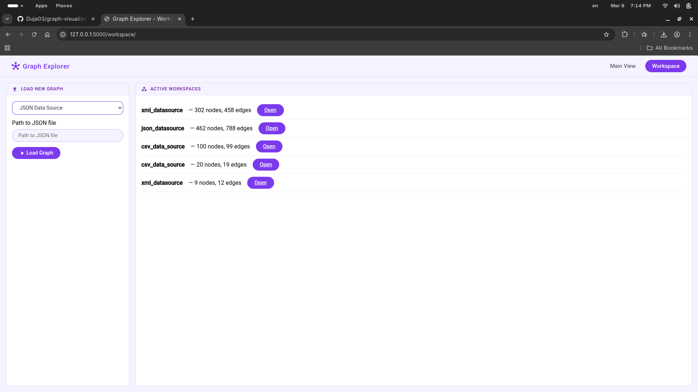
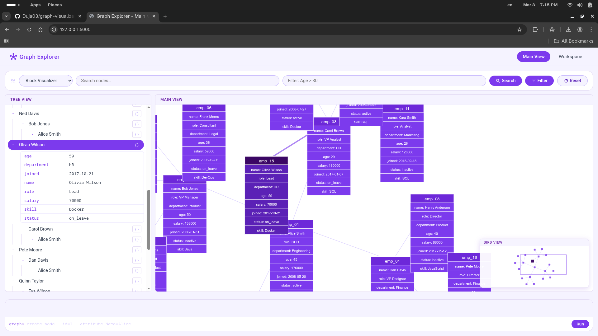
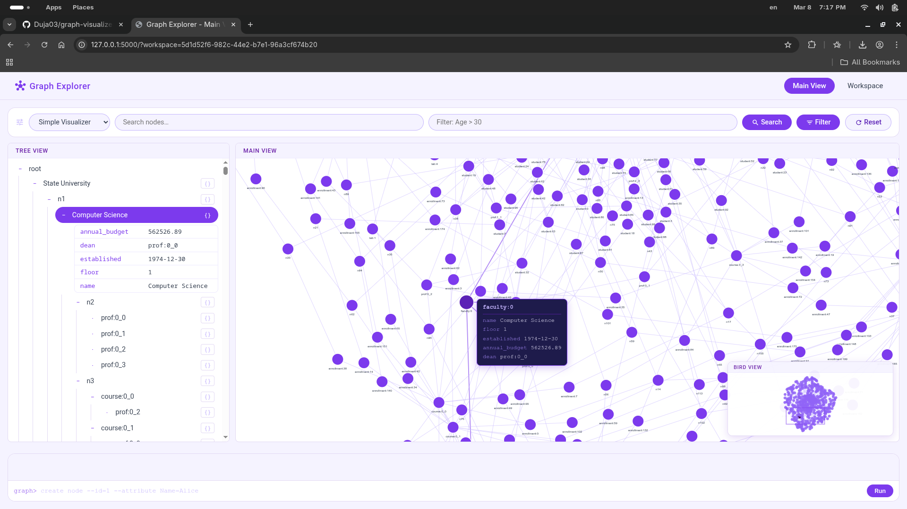
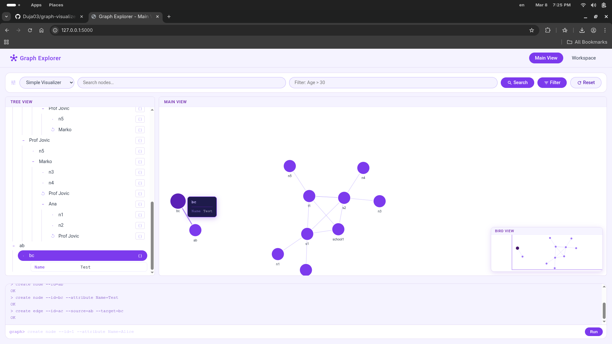

# Graph-Visualiser

A web-based graph exploration and visualization tool built with a plugin-based architecture. Load graphs from multiple data sources (CSV, JSON, XML) and explore them interactively through three synchronized views — Tree, Bird's Eye, and Main — using two distinct visualizer styles.

---

### Workspace — Loading & Managing Graphs

Load graphs from CSV, JSON, or XML sources. All active workspaces are listed with their node and edge counts.



---

### Block Visualizer

Nodes are rendered as rich attribute cards. Ideal for exploring graphs with detailed node properties.




---

### Simple Visualizer

Nodes are rendered as compact circles connected by edges. Best suited for large graphs where structure matters more than individual node details. Click any node to inspect its properties.



> Switch between visualizers at any time using the dropdown in the toolbar.

---

### CLI, Search & Filter

The toolbar exposes a **search** bar for finding nodes by name and a **filter** input 
for attribute-based queries (e.g. `Age > 30`). For more direct control, the built-in 
**CLI** at the bottom of the screen lets you create and delete nodes and edges without 
leaving the visualizer.



---

### Contributors

1. Aleksa Ćurčić
2. Maksim Vasić
3. Milan Kačarević
4. Miomir Dujanović
5. Sara Stojkov

### Installation

First, activate your virtual environment from the project root:

**Windows:**
```bash
.venv\Scripts\activate

```

**Unix/Mac:**
```bash
source .venv/bin/activate
```

Then run the install script to install all components:

**Windows:**
```bash
scripts/installation/install.bat
```

**Unix/Mac:**
```bash
./scripts/installation/install.sh
```
If the script is not executable, run:
```bash
chmod +x scripts/installation/install.sh
./scripts/installation/install.sh
```

### Running the Application

Both Django and Flask are fully independent web applications. Each can be run
and used on its own. They do not depend on each other.

### Running the Django app
```bash
cd graph_explorer/django_app
python manage.py runserver
```

Django will be available at http://127.0.0.1:8000

### Running the Flask app
```bash
cd graph_explorer/flask_app
python -m run
```

Flask will be available at http://127.0.0.1:5000

### Note

Both apps provide the same functionality independently. You do not need to run
both at the same time - each one is a complete standalone application.
