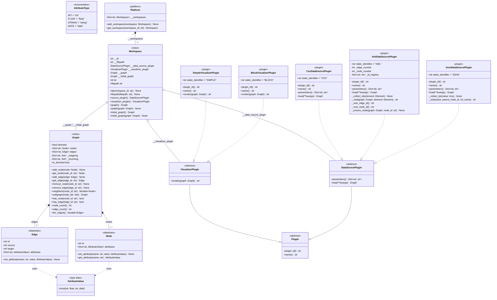

# Graph Visualization Tool — Class Diagram

> **Software Patterns & Components** · `api` / `platform` / `data_source_plugin` / `visualizer_plugin`

---

## Component Overview

| Layer | Classes | Package |
|---|---|---|
| **Model** | `Node`, `Edge`, `Graph`, `AttributeType`, `AttributeValue` | `api` |
| **Abstractions** | `Plugin`, `DataSourcePlugin`, `VisualizerPlugin` | `api` |
| **Platform** | `Platform`, `Workspace` | `platform` |
| **Data source plugins** | `JsonDataSourcePlugin`, `XmlDataSourcePlugin`, `CsvDataSourcePlugin` | `*_data_source_plugin` |
| **Visualizer plugins** | `BlockVisualizerPlugin`, `SimpleVisualizerPlugin` *(pending)* | `block_visualizer`, `simple_visualizer` |

## Relationship Key

| Notation | Meaning |
|---|---|
| `*--` | Composition |
| `o--` | Aggregation |
| `--|>` | Inheritance (extends) |
| `..|>` | Implementation (realization) |
| `..>` | Dependency / uses |