# Graph Visualization Tool — Class Diagram

> **Software Patterns & Components** · `api` / `platform` / `core` / `commands` / plugins

```mermaid
classDiagram

    %% ── Enums / type aliases ────────────────────────────────────────────────

    class AttributeType {
        <<enumeration>>
        INT = "int"
        FLOAT = "float"
        STRING = "string"
        DATE = "date"
    }

    class AttributeValue {
        <<type alias>>
        Union[int, float, str, date]
    }

    %% ── Core model ──────────────────────────────────────────────────────────

    class Node {
        <<dataclass, slots=True>>
        +str id
        +Dict~str, AttributeValue~ attributes
        +set_attribute(name: str, value: AttributeValue) None
        +get_attribute(name: str) Optional~AttributeValue~
    }

    class Edge {
        <<dataclass, slots=True>>
        +str id
        +str source
        +str target
        +Dict~str, AttributeValue~ attributes
        +set_attribute(name: str, value: AttributeValue) None
    }

    class Graph {
        <<class>>
        +bool directed
        +Dict~str, Node~ nodes
        +Dict~str, Edge~ edges
        -Dict~str, Set~ _outgoing
        -Dict~str, Set~ _incoming
        +add_node(node: Node) None
        +get_node(node_id: str) Node
        +add_edge(edge: Edge) None
        +get_edge(edge_id: str) Edge
        +remove_node(node_id: str) None
        +remove_edge(edge_id: str) None
        +neighbors(node_id: str) Iterable~Node~
        +subgraph(node_ids: Set~str~) Graph
        +has_node(node_id: str) bool
        +has_edge(edge_id: str) bool
        +node_count() int
        +edge_count() int
        +iter_edges() Iterable~Edge~
        +__len__() int
        +__iter__() Iterator~Node~
        +is_directed bool
    }

    %% ── API abstractions ────────────────────────────────────────────────────

    class Plugin {
        <<abstract>>
        +plugin_id()* str
        +name()* str
    }

    class DataSourcePlugin {
        <<abstract>>
        +parameters()* Dict~str, str~
        +load(**kwargs)* Graph
    }

    class VisualizerPlugin {
        <<abstract>>
        +render(graph: Graph)* str
    }

    %% ── Platform ────────────────────────────────────────────────────────────

    class Platform {
        <<platform>>
        -Dict~int, Workspace~ __workspaces
        +add_workspace(workspace: Workspace) None
        +get_workspace(workspace_id: int) Workspace
    }

    class Workspace {
        <<class>>
        -str __id
        -str __filepath
        -DataSourcePlugin __data_source_plugin
        -VisualizerPlugin __visualizer_plugin
        -Graph __graph
        -Graph __initial_graph
        +id str
        +id(workspace_id: str) None
        +filepath str
        +filepath(filepath: str) None
        +source_plugin() DataSourcePlugin
        +visualizer_plugin() VisualizerPlugin
        +graph() Graph
        +graph(graph: Graph) None
        +initial_graph() Graph
        +initial_graph(graph: Graph) None
    }

    class WorkspaceStore {
        <<class>>
        -Dict~str, Workspace~ _workspaces
        +create_workspace(graph, plugin, filepath) str
        +get_workspace(workspace_id: str) Optional~Workspace~
        +list_workspaces() List~Workspace~
        +delete_workspace(workspace_id: str) bool
    }

    class PluginRegistry {
        <<class>>
        -dict~str, type~ _datasource_plugins
        -dict~str, type~ _visualizer_plugins
        -_discover() None
        +get_plugin(plugin_id: str) Optional~type~
        +get_all_plugins() List~type~
        +get_visualizer_plugin(plugin_id: str) Optional~type~
        +get_all_visualizer_plugins() List~type~
    }

    %% ── Data source plugins ─────────────────────────────────────────────────

    class JsonDataSourcePlugin {
        <<plugin>>
        +str static_identifier = "JSON"
        +plugin_id() str
        +name() str
        +parameters() Dict~str, str~
        +load(**kwargs) Graph
    }

    class XmlDataSourcePlugin {
        <<plugin>>
        +str static_identifier = "XML"
        -int _edge_counter
        -int _node_counter
        -Dict~str, str~ _id_registry
        +plugin_id() str
        +name() str
        +parameters() Dict~str, str~
        +load(**kwargs) Graph
        -_collect_ids(element: Element) None
        -_visit(graph: Graph, element: Element) str
        -_new_edge_id() str
        -_new_node_id() str
        -_ensure_node(graph: Graph, node_id: str) None
    }

    class CsvDataSourcePlugin {
        <<plugin>>
        +str static_identifier = "CSV"
        +plugin_id() str
        +name() str
        +parameters() Dict~str, str~
        +load(**kwargs) Graph
    }

    %% ── Visualizer plugins ──────────────────────────────────────────────────

    class BlockVisualizerPlugin {
        <<plugin>>
        +str static_identifier = "BLOCK"
        +plugin_id() str
        +name() str
        +render(graph: Graph) str
    }

    class DateSerializer {
        <<helper>>
        +default(obj) str
    }

    class SimpleVisualizerPlugin {
        <<plugin>>
        +str static_identifier = "SIMPLE"
        +plugin_id() str
        +name() str
        +render(graph: Graph) str
    }

    %% ── Command pattern ─────────────────────────────────────────────────────

    class Command {
        <<abstract>>
        +execute()* Any
    }

    class CreateNodeCommand {
        <<command>>
        +Graph graph
        +str node_id
        +Dict~str, AttributeValue~ attributes
        +execute() None
    }

    class EditNodeCommand {
        <<command>>
        +Graph graph
        +str node_id
        +Dict~str, AttributeValue~ attributes
        +execute() None
    }

    class DeleteNodeCommand {
        <<command>>
        +Graph graph
        +str node_id
        +execute() None
    }

    class CreateEdgeCommand {
        <<command>>
        +Graph graph
        +str edge_id
        +str source
        +str target
        +Dict~str, AttributeValue~ attributes
        +execute() None
    }

    class EditEdgeCommand {
        <<command>>
        +Graph graph
        +str edge_id
        +Dict~str, AttributeValue~ attributes
        +execute() None
    }

    class DeleteEdgeCommand {
        <<command>>
        +Graph graph
        +str edge_id
        +execute() None
    }

    class DeleteGraphCommand {
        <<command>>
        +Graph graph
        +execute() None
    }

    class FilterCommand {
        <<command>>
        +Graph graph
        +str filter_str
        +execute() Graph
    }

    class SearchCommand {
        <<command>>
        +Graph graph
        +str query
        +execute() Graph
    }

    %% ── CLI ─────────────────────────────────────────────────────────────────

    class Method {
        <<enumeration>>
        CREATE = "create"
        EDIT = "edit"
        DELETE = "delete"
        FILTER = "filter"
        SEARCH = "search"
    }

    class Subject {
        <<enumeration>>
        NODE = "node"
        EDGE = "edge"
        GRAPH = "graph"
    }

    class CLIParser {
        <<class>>
        +parse(command: str, graph: Graph)$ Command
        -_parse_method(command: str)$ Method
        -_parse_subject(command: str)$ Subject
        -_parse_id(command: str)$ str
        -_parse_attributes(command: str)$ Dict
        -_parse_search_arguments(command: str)$ str
        -_parse_create_node_arguments(command: str)$ Tuple
        -_parse_edit_node_arguments(command: str)$ Tuple
        -_parse_delete_node_arguments(command: str)$ str
        -_parse_create_edge_arguments(command: str)$ Tuple
        -_parse_edit_edge_arguments(command: str)$ Tuple
        -_parse_delete_edge_arguments(command: str)$ str
    }

    class CLIExecutor {
        <<class>>
        +execute(command: Command)$ Any
    }

    class CLIParseError {
        <<exception>>
    }

    %% ── Core engines ────────────────────────────────────────────────────────

    class FilterEngine {
        <<class>>
        +filter(graph: Graph, filter_str: str)$ Graph
    }

    class FilterError {
        <<exception>>
    }

    class SearchEngine {
        <<class>>
        -Graph _graph
        +search(query: str) Graph
        -_node_matches(node: Node, query_lower: str)$ bool
    }

    %% ── Relationships ───────────────────────────────────────────────────────

    %% model
    Node ..> AttributeValue : uses
    Edge ..> AttributeValue : uses
    Graph "1" *-- "0..*" Node : nodes
    Graph "1" *-- "0..*" Edge : edges

    %% plugin abstractions
    DataSourcePlugin --|> Plugin
    VisualizerPlugin --|> Plugin

    %% plugin implementations
    JsonDataSourcePlugin   ..|> DataSourcePlugin
    XmlDataSourcePlugin    ..|> DataSourcePlugin
    CsvDataSourcePlugin    ..|> DataSourcePlugin
    BlockVisualizerPlugin  ..|> VisualizerPlugin
    SimpleVisualizerPlugin ..|> VisualizerPlugin
    SimpleVisualizerPlugin ..> DateSerializer : uses

    %% platform
    Platform "1" *-- "0..*" Workspace : __workspaces
    Workspace o-- DataSourcePlugin : source_plugin
    Workspace o-- VisualizerPlugin : visualizer_plugin
    Workspace o-- Graph            : graph / initial_graph
    WorkspaceStore "1" *-- "0..*" Workspace : _workspaces
    PluginRegistry ..> DataSourcePlugin : discovers
    PluginRegistry ..> VisualizerPlugin : discovers

    %% command pattern
    CreateNodeCommand    ..|> Command
    EditNodeCommand      ..|> Command
    DeleteNodeCommand    ..|> Command
    CreateEdgeCommand    ..|> Command
    EditEdgeCommand      ..|> Command
    DeleteEdgeCommand    ..|> Command
    DeleteGraphCommand   ..|> Command
    FilterCommand        ..|> Command
    SearchCommand        ..|> Command

    CreateNodeCommand  ..> Graph : mutates
    EditNodeCommand    ..> Graph : mutates
    DeleteNodeCommand  ..> Graph : mutates
    CreateEdgeCommand  ..> Graph : mutates
    EditEdgeCommand    ..> Graph : mutates
    DeleteEdgeCommand  ..> Graph : mutates
    DeleteGraphCommand ..> Graph : clears
    FilterCommand      ..> FilterEngine : delegates
    SearchCommand      ..> SearchEngine : delegates

    %% CLI
    CLIParser ..> Command   : creates
    CLIParser ..> Method    : uses
    CLIParser ..> Subject   : uses
    CLIParser ..> CLIParseError : raises
    CLIExecutor ..> Command : executes
    CLIExecutor ..> FilterError : catches

    %% engines
    FilterEngine ..> Graph : returns subgraph
    FilterEngine ..> FilterError : raises
    SearchEngine ..> Graph : returns subgraph
```

---

## Component Overview

| Layer | Classes | Package |
|---|---|---|
| **Model** | `Node`, `Edge`, `Graph`, `AttributeType`, `AttributeValue` | `api` |
| **Abstractions** | `Plugin`, `DataSourcePlugin`, `VisualizerPlugin` | `api` |
| **Platform** | `Platform`, `Workspace`, `WorkspaceStore`, `PluginRegistry` | `platform` |
| **Data source plugins** | `JsonDataSourcePlugin`, `XmlDataSourcePlugin`, `CsvDataSourcePlugin` | `*_data_source_plugin` |
| **Visualizer plugins** | `BlockVisualizerPlugin`, `SimpleVisualizerPlugin` | `block_visualizer`, `simple_visualizer` |
| **Commands** | `Command`, `CreateNodeCommand`, `EditNodeCommand`, `DeleteNodeCommand`, `CreateEdgeCommand`, `EditEdgeCommand`, `DeleteEdgeCommand`, `DeleteGraphCommand`, `FilterCommand`, `SearchCommand` | `commands` |
| **CLI** | `CLIParser`, `CLIExecutor`, `CLIParseError`, `Method`, `Subject` | `commands` |
| **Core engines** | `FilterEngine`, `FilterError`, `SearchEngine` | `core` |

## Relationship Key

| Notation | Line style | Meaning | Example in diagram |
|---|---|---|---|
| `--\|>` | Solid + open arrowhead | Inheritance — abstract extends abstract base | `DataSourcePlugin` extends `Plugin` |
| `..\|>` | Dashed + open arrowhead | Inheritance — concrete extends abstract base | `JsonDataSourcePlugin` extends `DataSourcePlugin` |
| `*--` | Solid + filled diamond | Composition — owner controls lifecycle of part | `Graph` composes `Node`, `Edge` |
| `o--` | Solid + open diamond | Aggregation — owner references but does not own | `Workspace` aggregates `Graph` |
| `..>` | Dashed arrow | Dependency / uses | `Node` uses `AttributeValue` |

> **Note:** Both `--\|>` and `..\|>` represent Python class inheritance (`class X(Y)`).
> The solid line is used between two abstract classes, and the dashed line when a concrete class extends an abstract one — following standard UML convention.